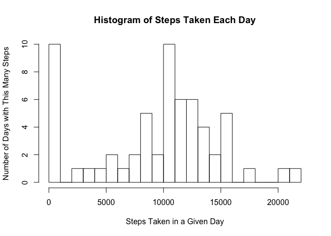
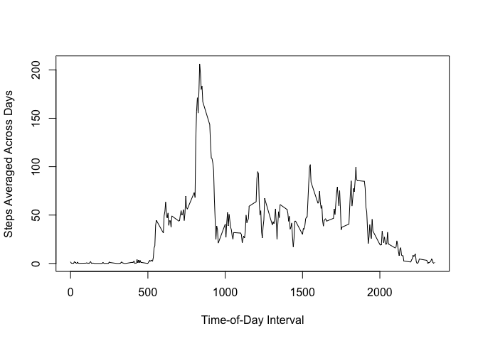
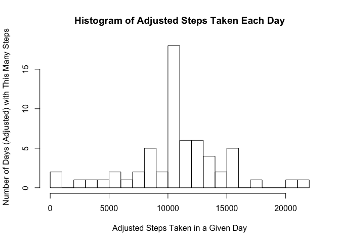

# Reproducible Research: Peer Assessment 1

## 1. Introduction

The aim of this report is to present a basic analysis of physical activity data and to answer some basic questions about it, showing how the answers are determined.

The report is provided for Peer Assessment 1 for the Coursera course "Reproducible Research", given during July of 2015.

### About the Data
The data set is contained in the file `activity.csv`, provided in compressed form in the file `activity.zip` and made available on the course web site from the URL:

[Activity Monitoring Data](https://d396qusza40orc.cloudfront.net/repdata%2Fdata%2Factivity.zip)

For purposes of this analysis the `activity.csv` data file is contained in the `data` subdirectory.

This data set contains counts of steps taken in each 5-minute interval each day during the months of October and November of 2012:
* 288 5-minute intervals per day:
  - 12 5-minute intervals each hour
  - 24 hours each day
* 61 days of data
  - 31 days in October 2012
  - 30 days in November 2012

This provides us with a total of 17568 data points.

The file is in CSV format, with one heading line and one line of text for each data point.

Each data point (row of the data set) has 3 columns:
* "steps", containing a count of steps for the indicated 5-minute period
* "date", the date on which the data point was measured, in the format YYYY-MM-DD.
* "interval", identifying the 5-minute interval of the day during which the data point was measured.  This is a number of the form HHMM (HH for hours and MM for minutes) to indicate time on a 24-hour clock, but with leading zeros omitted; for example 0 means 00:00 or 12 midnight; 100 means 1am, 1135 means 11:35am, etc.  For purposes of the computation, the interpretation of this field as a time doesn't actually matter, but it is helpful to keep in mind to make sense of the data presented.

Visual examination of the data indicates that there are some missing data points.  Specifically,
* NA values occur, but only in the "steps" column.
* NA values occur for complete days only -- from intervals 0 through 2355 of an entire day.
* 8 dates have missing values, for a total of 2304 missing values.
* This leaves 53 days worth of complete data.

### About the Assignment

The assignment requests that the following steps be performed:

1. Read the data and perform necessary pre-processing.
2. Look at the steps per day:
  * For each day, compute the _total_ number of steps.
  * Plot a _histogram_ of values that occur in the total steps per day.
  * Calculate and report the mean and median of the total steps per day.
3. Look at the average daily pattern:
  * For each _interval_, compute the _average_ number of steps across all days.
  * Make a _time series_ plot of the average number of steps ocurring in each time interval.
  * Report the interval which has the largest average number of steps.
4. Impute missing values and re-examine the steps per day.  Similar to step 2, but using imputed data to fill in for the missing values.
  * Devise and explain a strategy for imputing missing values.
  * Create a new data frame which replaces the missing values with imputed values.
  * For each day, compute the average number of steps.
  * Plot a histogram of values that occur.
  * Calculate nd report the mean and median of the total steps per day.
  * Compare with results obtained without imputed values:
    - Does the result with adjusted data differ than the result with unadjusted data?
    - What is the impact of the adjustment on the total daily number of steps?
5. Compare the average daily pattern for weekdays and weekends; similar to step 3 but separating weekday and weekend data to compare them:
  * Split weekday and weekend data by adding a factor variable
  * Do the computation like step 3 on the weekday and weekend subsets.
  * Make a panel plot, with each panel like the plot for step 3.  One panel for weekday data, one for weekend data.
  * Discuss differences in the activity pattern between weekdays and weekends.

## 2. Loading and preprocessing the data

Reading the data is fairly straightforward since it is provided in the CSV text format that can be read directly by `read.csv`.

The raw `zip` archive is assumed to have been downloaded and unzipped into the `data` subdirectory prior to running the R code for this analysis.

Additional processing to handle missing values or to group subsets of data is specific to each of the subsequent analytical questions so is deferred to the relevant steps.


```r
activity <- read.csv("data/activity.csv")
```

## 3. A Look at the Total Number of Steps per Day

For this part of the analysis, the additional processing of the data is to
a. Omit rows with missing values; this is incorporated into the computation.
b. Split the rows using the date as a factor, so that each date's steps can easily be summed up.


```r
steps.by.day <- split(activity, activity$date)
total.steps.by.day <- sapply(steps.by.day, function(x) sum(x[["steps"]], na.rm = TRUE))
```

The distribution of the number of steps per day is seen in the following histogram:


```r
hist(total.steps.by.day, breaks=20, main="Histogram of Steps Taken Each Day",
     xlab="Steps Taken in a Given Day", ylab="Number of Days with This Many Steps")
```

 

From this it can be seen that there is a roughly Gaussian distribution of steps taken per day, with the exception that there are many days when 0 steps are taken.  The interpretation is that _on days when measuring steps_, there is an approximately Gaussing distribution centered a little above 10000 steps per day.

The mean steps per day is calculated from the total steps per day:

```r
mean.steps.per.day <- mean(total.steps.by.day)
mean.steps.per.day
```

```
## [1] 9354.23
```

The median steps per day is calculated similarly:

```r
median.steps.per.day <- median(total.steps.by.day)
median.steps.per.day
```

```
## [1] 10395
```

It should be noted that the mean and median values computed here include the days when no steps are taken.

## 4. A Look at the Average Daily Activity Pattern

For the average daily activity pattern, the processing of the data is:
a. Again, omit the rows wit missing values as part of the computation.
b. Again split the data, but this time using the _interval_ as a factor, so we can easily average the steps take at each interval across all days.


```r
steps.by.interval <- split(activity, activity$interval)
mean.steps.by.interval <- lapply(steps.by.interval, function(x) mean(x[["steps"]], na.rm = TRUE))
```

The average daily activity pattern is easily seen in this plot:

```r
plot(names(mean.steps.by.interval), mean.steps.by.interval, type="l",
     xlab="Time-of-Day Interval", ylab="Steps Averaged Across Days")
```

 

Looking at the plot it can be seen that there is a clear peak in the morning, a much lower level of activity during much of the rest of the day, and activity tapering off to essentially nothing overnight.

Tp be a bit more specific about the peak, the interval of the day during which the maximum average number of steps is taken is

```r
max.steps.interval <- which.max(mean.steps.by.interval)
names(max.steps.interval)
```

```
## [1] "835"
```
for which the number of steps taken is

```r
mean.steps.by.interval[max.steps.interval]
```

```
## $`835`
## [1] 206.1698
```

## 5. What Happens When Imputing Missing Values?

Note there are a number of missing values in the original data.  The number of intervals in the complete data set which have missing values is:

```r
incomplete.activity <- !complete.cases(activity)
sum(incomplete.activity)
```

```
## [1] 2304
```

To adjust for the possible biases introduced by missing values, we'll adjust the data set by imputing values in cases where the original values are missing.  The strategy for this is to apply the value for the mean for the corresponding interval.


```r
m <- matrix(mean.steps.by.interval)
colnames(m) <- c("mean")
temp <- cbind(activity, m)
imputed <- matrix(nrow=length(activity), ncol=1)
colnames(imputed) <- c("imputed")
for (i in 1:length(incomplete.activity)) {
  imputed[i] <- if (incomplete.activity[i]) temp$mean[[i]] else temp$steps[[i]]
}
adjusted.activity <- cbind(activity, imputed)
```

Redoing the initial set of calculations using the imputed values, we look at the results:

```r
adjusted.steps.by.day <- split(adjusted.activity, activity$date)
adjusted.total.steps.by.day <- sapply(adjusted.steps.by.day, function(x) sum(x[["imputed"]]))
```


```r
hist(adjusted.total.steps.by.day, breaks=20, main="Histogram of Adjusted Steps Taken Each Day",
     xlab="Adjusted Steps Taken in a Given Day", ylab="Number of Days (Adjusted) with This Many Steps")
```

 

```r
adjusted.mean.steps.per.day <- mean(adjusted.total.steps.by.day)
adjusted.mean.steps.per.day
```

```
## [1] 10766.19
```

```r
adjusted.median.steps.per.day <- median(adjusted.total.steps.by.day)
adjusted.median.steps.per.day
```

```
## [1] 10766.19
```

## 6. Comparison of Average Daily Activity Pattern between Weekdays and Weekends


